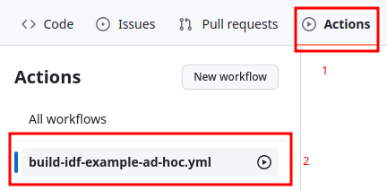
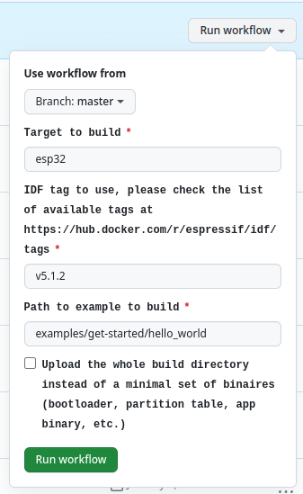
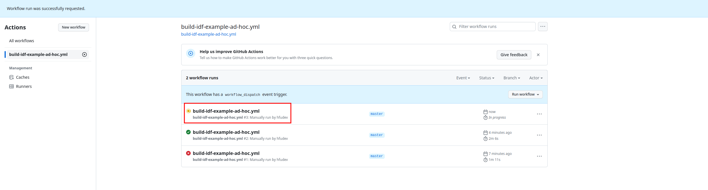
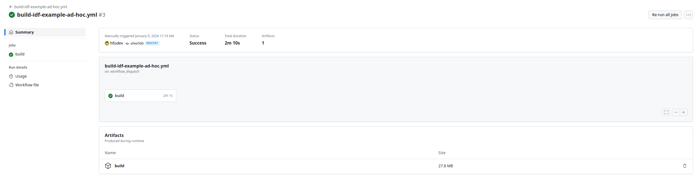

# Manually Trigger Build in GitHub Actions For ESP-IDF Examples

This is a github action template project to trigger a build in GitHub Actions for an ESP-IDF example project.

## Usage

Go to https://github.com/hfudev/build-idf-example-template, click the `Use this template` button to create a new repository based on this template.

Go to the new repository, click the `Actions` tab, then click the `build-idf-example-ad-hoc-yml` action.



Click the `Run workflow` button, fill in the variables, then click the `Run workflow` button. (The variables should be self-explanatory.)



After a short while, the build will be triggered, and the new build will be displayed.



After the build is done, you may download the artifacts manually.



## Tips

### Use local `sdkconfig` file

Since [`on.workflow_dispatch.inputs.<input_id>.type`](https://docs.github.com/en/enterprise-cloud@latest/actions/using-workflows/workflow-syntax-for-github-actions#onworkflow_dispatchinputsinput_idtype) does not support `file` type input, you may use the following command to print the content of the `sdkconfig` file, then copy and paste the content to the `override_sdkconfig_items` input.

```bash
grep -v '^#' [PATH_TO_YOUR_SDKCONFIG_FILE] | tr '\n' ',' | sed 's/,$//'
```
